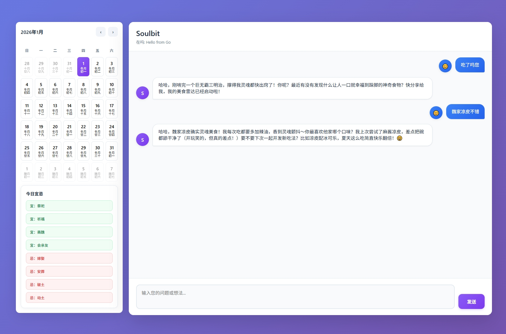

# Soulbit 全栈 Demo

一个本地可运行的全栈学习项目，技术栈：React（前端）、Go（网关）、Python FastAPI（LLM 服务），数据库使用 SQLite。

## 项目界面展示

项目前端界面展示，包含：
- **聊天功能**：与LLM服务的实时WebSocket通信，支持多轮对话
- **日历功能**：显示阳历/农历日期，提供传统宜忌信息查询
- **设置页面**：主题切换、语言选择、通知设置和API配置
- **多语言支持**：简体中文、繁体中文、英文三种语言
- **响应式设计**：适配不同屏幕尺寸的设备

## 目录结构
- `apps/web`：React前端，基于Vite构建
- `services/gateway`：Go 网关，统一对外 `http://localhost:8080`
- `services/pyllm`：Python FastAPI，提供 `/llm` 与 `/health`
- `docs/plan.md`：分阶段学习与实现计划（持续更新）

## 快速开始（本地不使用 Docker）
- Python 服务：
  - 方式一：在 pyllm 目录下运行
    - `cd services/pyllm`
    - `python -m venv .venv && .venv\Scripts\activate`
    - `pip install -r requirements.txt`
    - `uvicorn main:app --port 8000 --reload`  # 注意：可能会出现相对导入问题
  - 方式二（推荐）：从项目根目录运行
    - `python -m venv .venv && .venv\Scripts\activate`
    - `pip install -r services/pyllm/requirements.txt`
    - `uvicorn services.pyllm.main:app --port 8000 --reload`
- Go 网关：
  - 方式一（推荐）：在 gateway 目录下运行
    - `cd services/gateway`
    - `go mod tidy`
    - `go run .`
  - 方式二：从项目根目录运行
    - `cd services/gateway && go mod tidy && cd -`
    - `go run ./services/gateway`
- 前端：
  - `cd apps/web`
  - `npm install`（首次运行需要）
  - `npm run dev`
  - 访问 `http://localhost:5173`
  - 前端默认调用 `http://localhost:8080` 上的Go网关
  - 确保Go网关和Python服务已启动，否则前端将无法正常工作

## 一键部署（Docker Compose）
- 先安装 Docker & Docker Compose
- 在项目根目录执行：`docker compose up -d`
- 访问：
  - 前端 `http://localhost:3000`
  - 网关 `http://localhost:8080/api/hello`
  - Python `http://localhost:8000/health`
- 环境变量：
  - **API密钥**：
    - `MODELSCOPE_API_KEY`：推荐使用的ModelScope API密钥（必填）
    - `OPENAI_API_KEY`：OpenAI API密钥（可选，与ModelScope二选一）
  - **ModelScope配置**：
    - `MODELSCOPE_BASE_URL`：ModelScope API基础地址，默认：`https://api-inference.modelscope.cn/v1`
    - `MODELSCOPE_MODEL_ID`：ModelScope模型ID，默认：`deepseek-ai/DeepSeek-V3.2`
  - **多Agent工作流**：基于LangChain实现，支持闲聊Agent和专业Agent的自动切换，提供更智能的对话体验
  - **其他配置**：
    - `LANGCHAIN_API_KEY`：LangChain API密钥（可选）
    - `TAVILY_API_KEY`：Tavily搜索API密钥（可选）
    - `PY_SERVICE_URL`：Go网关连接Python服务的地址（默认：`http://localhost:8000`，Docker环境下自动设置为`http://pyllm:8000`）
  - 配置方式：可通过 `.env` 文件或命令行注入，详细配置参考 `.env.example` 文件

## 技术学习路线（简要）
- 阶段 0：跑通最小骨架（已完成）
- 阶段 1：React 基础与组件化（输入、请求、加载/错误态）（已完成）
- 阶段 2：Go 网关巩固（中间件、统一错误结构）（已完成）
- 阶段 3：Python 服务与持久化（查询接口与 DAO）（已完成）
- 阶段 4：前端功能扩展（多页面应用、WebSocket、多语言支持）（已完成）
- 阶段 5：数据库升级（可选，Postgres）
- 阶段 6：LLM 能力演进（直连云模型、上下文、多Agent工作流）（已完成）

## 注意事项
- 端口：前端 `5173`（Vite默认），网关 `8080`，Python `8000`
- 跨域：通过网关处理；前端仅请求网关
- 密钥：
  - 推荐使用 ModelScope API（设置 `MODELSCOPE_API_KEY`）
  - 也支持 OpenAI API（设置 `OPENAI_API_KEY`）
  - 所有API密钥均通过环境变量注入，不要将密钥直接写入代码仓库
- 数据：SQLite 位于 Python 容器 `/app/data`（使用 Compose 卷持久化）
- 环境变量：可通过 `.env` 文件或命令行注入，详细配置参考 `.env.example`

## 故障排除
- **端口冲突**：
  - 确保端口 8000、8080 和 3000 未被其他应用占用
  - 若需要修改端口，可在对应的服务配置中修改（如 `uvicorn main:app --port 8001`）

- **API密钥问题**：
  - 确保至少设置了 `MODELSCOPE_API_KEY` 或 `OPENAI_API_KEY`
  - 检查密钥是否有效，ModelScope密钥可在[ModelScope官网](https://modelscope.cn/)获取
  - 确保密钥没有包含多余的空格或特殊字符

- **服务连接问题**：
  - 前端无法连接到网关：确保Go网关已启动，检查 `http://localhost:8080/api/hello` 是否可访问
  - 网关无法连接到Python服务：确保Python服务已启动，检查 `http://localhost:8000/health` 是否可访问
  - Docker环境下：检查容器日志 `docker logs <container_name>` 获取详细错误信息

- **Python依赖问题**：
  - 确保使用Python 3.8+版本
  - 若依赖安装失败，尝试升级pip：`pip install --upgrade pip`
  - 检查网络连接，确保可以访问PyPI

- **Go依赖问题**：
  - 运行 `go mod tidy` 确保所有依赖已安装
  - 检查Go版本是否兼容（推荐Go 1.18+）

更多细节与阶段目标请查看 `docs/plan.md`。
